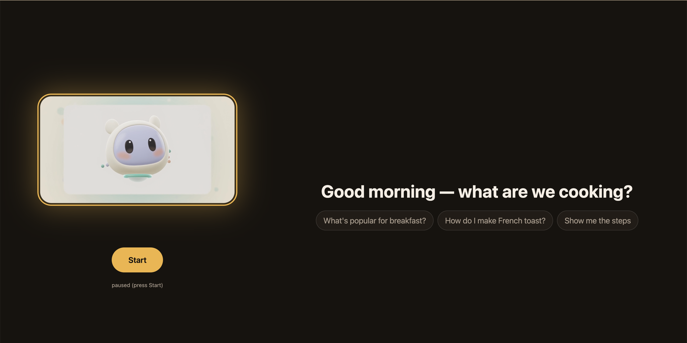

# CortexFlow
#### Long Horizon Agents Hackathon
---
A single-page, voice-first recipe assistant. The interface is a single orb that listens for a spoken request, then transitions through three states as recipe data comes back from the backend.

## Team

| Name | Email |
|---|---|
| Andreas Theodosis | andrewtheodoses@gmail.com |
| Jun Jiang | jiangjun0105@gmail.com |
| Rishith Saginala | saginalarishith@gmail.com |
